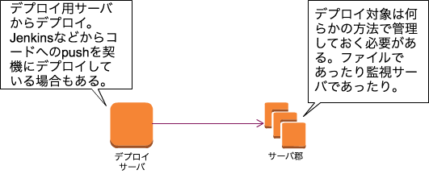
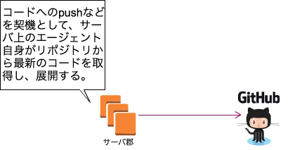
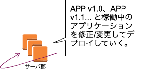
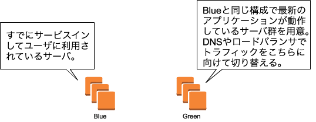
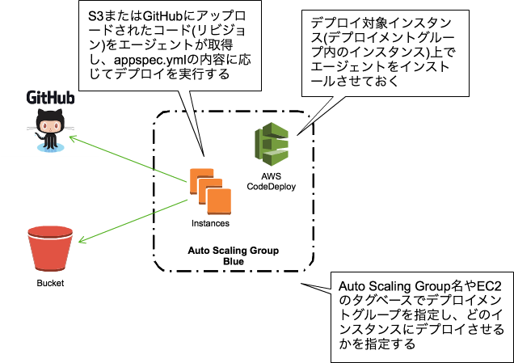
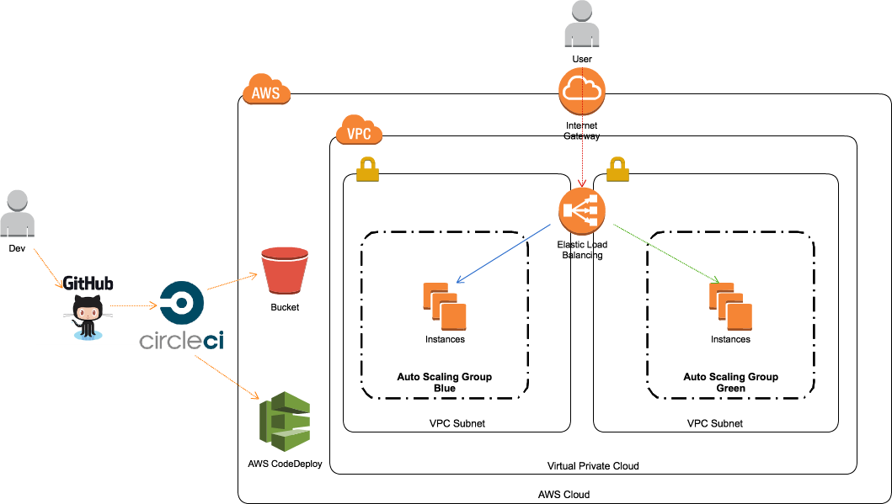
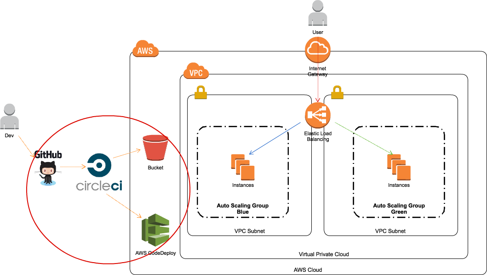
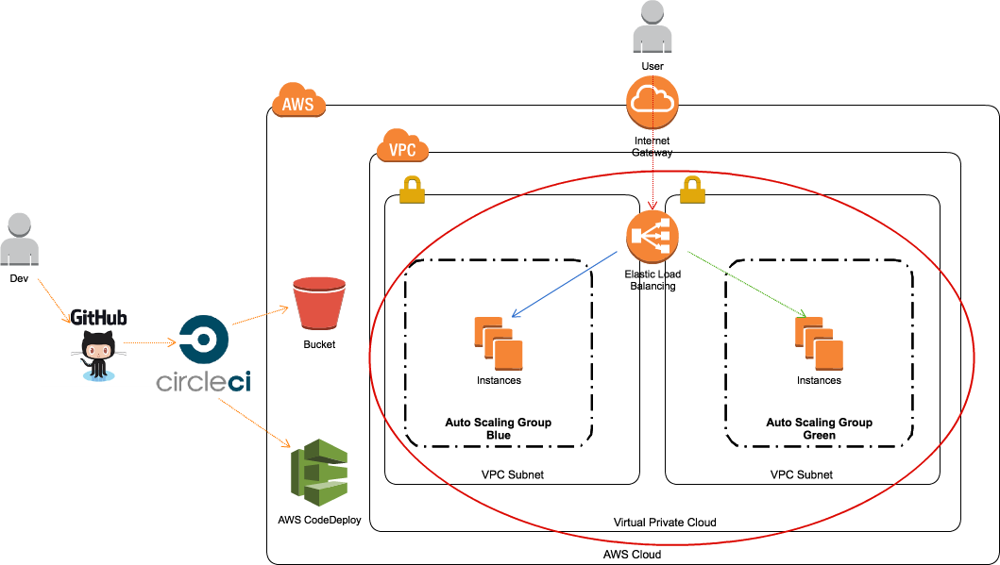
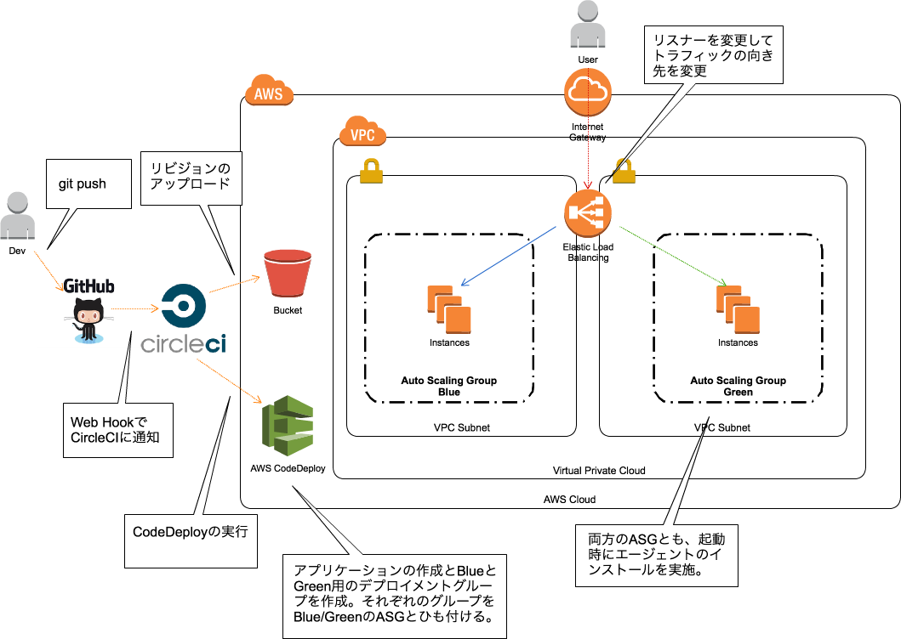

layout: true
class: center, middle

---
background-image: url(images/codedeploy.png)
# AWS CodeDeployの使い方
### 神戸デジタル・ラボ インフラ勉強会<br/>AWS勉強会(初心者向け) #2<br/>2016/10/03 中山 幸治

---
# 自己紹介

---
# 中山 幸治(knakayama)&nbsp;
### [https://knakayama.github.io](https://knakayama.github.io)
### 

---
# クラスメソッド<br/>AWSコンサルティング部<br/>所属

---
# 今日の資料↓に置いときました
### [https://github.com/knakayama/slide-2016-10-03](https://github.com/knakayama/slide-2016-10-03)
### 「knakayama」とかでググれば出てくると思います

---
layout: true
class: center, middle

---
# アジェンダ

---
layout: true
class: middle

---
### 1. デプロイとは
### 2. AWS CodeDeployの概要
### 3. 活用事例
### 4. 参考リンク

---
layout: true
class: center, middle

---
# 1. デプロイとは

---
# 一般的にはアプリケーションをサーバに配置/展開して利用可能な状態にすること

---
layout: true
class: middle

---
### - 原始的にはFTPなどでアプリケーションをサーバにコピー
### - 少し発展するとCapistrano/Fabricなどのツールを利用
### - 管理するサーバ台数が増加するとそれだけデプロイの重要性も増えてくる
### - さらにインスタンスを容易に増減できるクラウドの登場に伴いより高度なデプロイ方法が登場してきた

---
layout: true
class: center, middle

---
# デプロイのアーキテクチャ

---
layout: true
class: middle

---
### - デプロイのアーキテクチャには大きくpush型とpull型がある
### - push型はデプロイ用サーバから対象にファイルをコピー(push)する方式
### - 外部から接続できればデプロイ可能なので導入が比較的容易
### - pull型はデプロイ対象サーバからファイルを取得(pull)する方式
### - pullするためにサーバにエージェントなどを導入する必要がある

---
layout: true
class: center, middle

---
### push型

### pull型


---
layout: true
class: middle

---
### - クラウドでは簡単にインスタンスを増減可能なためデプロイ対象サーバを把握することは難しい
### - そのためサーバ自身でファイルを取得してくれるpull型デプロイと相性がよい
### - オンプレのようにサーバ数がほぼ固定のシステムにはpush型の方が導入が簡単

---
layout: true
class: center, middle

---
# デプロイ方法

---
layout: true
class: middle

---
### - デプロイ方法には大きく分けてローリングアップデートとBlue/Greenデプロイがある
### - ローリングアップデートはデプロイ対象に対して変更を積み重ねていく方式
### - デプロイ時に既存アプリケーションを修正/変更して新規ファイルを設置/反映する
### - 新規で構築したサーバと既存サーバ間で差異が発生しないように注意が必要
### - ツールにもよるがロールバックが難しいという問題もある

---
### - Blue/Greenデプロイはデプロイ対象とは全く別のシステムに対してデプロイを実行し、それらを入れ替える方式
### - 入れ替え方法はDNS(Route53)やロードバランサ(ELB/ALB)を利用
### - 入れ替えるだけなのでロールバックが簡単
### - クラウドの特性的に比較的容易にBlue/Greenデプロイが実現できるようになった

---
layout: true
class: center, middle

---
### ローリングアップデート

### Blue/Greenデプロイ


---
layout: true
class: center, middle

---
# 2. AWS CodeDeployの概要

---
> Amazon EC2 インスタンス、およびオンプレミスで稼働するインスタンスを含む、さまざまなインスタンスへのコードのデプロイを自動化するサービス

### - https://aws.amazon.com/jp/codedeploy/

---
layout: true
class: middle

---
### - インスタンス上にエージェント(AWS CodeDeploy Agent)を動作させるpull型デプロイツール
### - ちなみにエージェントはRuby製
### - EC2のタグやオートスケーリンググループ名に応じてデプロイ対象(デプロイメントグループ)を指定
### - 外部サービス(GitHub/CircleCIなど)と連携させたデプロイ自動化が比較的容易

---
### - 「アプリケーション」という単位でコードとCodeDeployをひも付ける
### - アプリケーションのコードをS3またはGitHubに設置
### - S3またはGitHubにアップロードされたコードをリビジョンと呼ぶ
### - インスタンス上のエージェントがリビジョンを取得し反映する

---
layout: true
class: center, middle

---
### CodeDeploy動作イメージ


---
layout: true
class: middle

---
### - デプロイ方法はappspec.ymlというYAMLファイルに記述
### - 配置するコードやミドルウェアの再起動処理などを記述可能
### - デプロイ時の各イベント(Hooks)毎にスクリプトを実行可能

---
layout: true
class: center, middle

---
### Hooks


---
layout: true
class: middle

---
### &nbsp;&nbsp;&nbsp;&nbsp;&nbsp;&nbsp;&nbsp;&nbsp;&nbsp;&nbsp;&nbsp;&nbsp;&nbsp;&nbsp;&nbsp;&nbsp;&nbsp;&nbsp;&nbsp;&nbsp;&nbsp;&nbsp;&nbsp;&nbsp;&nbsp;&nbsp;&nbsp;&nbsp;&nbsp;&nbsp;&nbsp;&nbsp;&nbsp;&nbsp;appspec.ymlの例

```yaml
# おまじない
version: 0.0
os: linux

# 配置するファイルを指定
files:
  - source: index.html
    destination: /usr/share/nginx/html

# Hookで実行するスクリプトを指定
hooks:
  ApplicationStop:
    - location: scripts/application_stop.sh
      timeout: 300
      runas: root
  BeforeInstall:
    - location: scripts/before_install.sh
      timeout: 300
      runas: root
  ApplicationStart:
    - location: scripts/application_start.sh
      timeout: 300
      runas: root
```

---
### - デプロイが実行されるタイミングは3つある
### - デプロイメントグループに該当するインスタンスが起動した時
### - 手動でデプロイを実行したとき(awscli or マネジメントコンソール)
### - CodeDeployと連携させた外部サービス経由

---
layout: true
class: center, middle

---
# 3. 活用事例

---
layout: true
class: center, middle

---
# AWS CodeDeployを利用したBlue/Greenデプロイ

---
### 全体構成図


---
layout: true
class: center, middle

---
# CodeDeployと<br/>外部サービスとの連携

---
### CodeDeployと外部サービスとの連携


---
layout: true
class: middle

---
### - CircleCIとGitHub上のリポジトリをひも付ける(リポジトリをFollowする)
### - GitHubへのpushを契機にWebHookでCircleCIへ通知される仕組みを作る
### - circle.ymlでS3へのリビジョンアップロードとデプロイを実行

---
### &nbsp;&nbsp;&nbsp;&nbsp;&nbsp;&nbsp;&nbsp;&nbsp;&nbsp;&nbsp;&nbsp;&nbsp;&nbsp;&nbsp;&nbsp;&nbsp;&nbsp;&nbsp;&nbsp;&nbsp;&nbsp;&nbsp;&nbsp;&nbsp;&nbsp;&nbsp;&nbsp;&nbsp;&nbsp;&nbsp;&nbsp;&nbsp;&nbsp;&nbsp;circle.ymlの例

```yaml
<snip>
deployment:
  blue:
    # リリースブランチ
    branch: release/blue
    codedeploy:
      # アプリケーション名
      bg-deploy-app:
        # リポジトリ内のどのディレクトリをルートとするか
        application_root: /app
        # リビジョンの配置場所(現在のところS3のみ)
        revision_location:
          revision_type: S3
          # バケット名とキー名
          s3_location:
            bucket: bg-deploy-app
            key_pattern: apps/{SHORT_COMMIT}
        region: ap-northeast-1
        # デプロイ対象のデプロイメントグループ名
        deployment_group: Blue
        # デプロイ方法
        deployment_config: CodeDeployDefault.AllAtOnce
```

---
layout: true
class: center, middle

---
# ELBとAuto Scaling Group

---
### ELBとAuto Scaling Group


---
layout: true
class: middle

---
### - ELBの下にAuto Scaling Groupをぶら下げる
### - 最初はBlue用Auto Scaling Groupにのみトラフィックを流す
### - この時Green用Auto Scaling Groupはmin/max/desired全て0で起動させない
### - アプリケーションに変更を加える場合に数値を調整しインスタンス起動

---
### - ユーザデータなどでCodeDeployエージェントをインストールしておく
### - リポジトリへのpushを契機にGreenにアプリケーションがデプロイされる
### - ELBの向き先をGreen用Auto Scaling Groupに向ける

---
layout: true
class: center, middle

---
### 全体構成図(詳細)


---
# 4. 参考リンク

---
layout: true
class: middle

---
### - Blue/Greenデプロイとは？
#### - http://aws.typepad.com/sajp/2015/12/what-is-blue-green-deployment.html
### - AWS公式ドキュメント
#### - https://aws.amazon.com/jp/codedeploy/
### - Black Belt Tech シリーズ
#### - http://www.slideshare.net/AmazonWebServicesJapan/aws-black-belt-tech-2015-aws-codecommit-aws-codepipeline-aws-codedeploy
### - Developers.IOのCodeDeployタグ
#### - http://dev.classmethod.jp/referencecat/aws-codedeploy/

---
layout: true
class: center, middle

---
# おわり

---
background-image: url(http://cdn.dev.classmethod.jp/wp-content/uploads/2016/07/mesoko_01.png)
**絶賛人材<br/>募集中**
## http://classmethod.jp/recruit/jobs/

---
# おわり(2回目)
